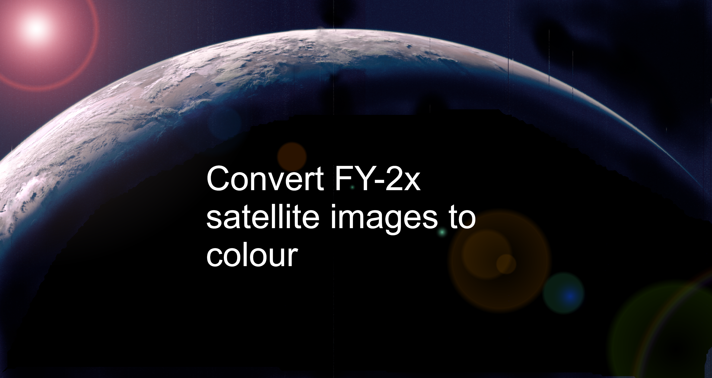

## Introduction

The Fengyun-2 series of satellites are geostationary satellites that deliver images of earth once per hour. The delivery consists of S-VISSR data: 1 VIS, 3 IR and 1 Watervapour images. They are delivered on the L-band frequency 1687.5 MHz. If you are within the footprint of the satellite, it is possible to receive with at least a 1.2m dish and Nooelec Saw filter.
As there are both VIS and IR channels, it is possible to create false colour images by using CLUT (colour look up table).

## Image data
Below are the following images and their resolutions delivered by the satellite.

## Image data resolutions
Channel | Type | Resolution |
------------ | ------------- | ------------- |
1 | IR | 2291 x 2501
2 | IR | 2291 x 2501
3 | WV | 2291 x 2501
4 | IR | 2291 x 2501
5 | VIS | 9160 x 10004

## Requirements
To use the CLUT requires the following:
Name | For | Author | Source
------------ | ------------- | ------------- | ------------- |
Decoder | Decodes the S-VISSR data | @aang254| https://github.com/altillimity/S-VISSR-Ingestor
GeoSatSignal | Applies the CLUT from a file | David Taylor |https://www.satsignal.eu/software/geosatsignal.htm
## Instructions
# Hardware requirements
You can use a 1.2m or larger dish. The feed skew needs to be set accordingly depending on location. For example in Japan, I need to set the feed skew to 45 degrees.
I use a patch antenna (shown) as it gives good dish illumination.

You need to rotate the feed to set the correct skew.

I use Nooelec Sawbird and SPF5189Z LNA for extra gain (if you need it). I don't think the bias tee output on the Airspy can output enough current to power both LNAs, so you would need to use external +5V supply. I use 4 x NiMH batteries.
# Signal in SDRSharp
The signal in SDRSharp is a 1 MHz wide signal and it is recommended to get at least 10 dB SNR for a error free image:
