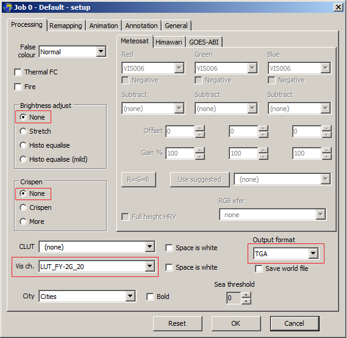

# Introduction

The Fengyun-2 series of satellites are geostationary satellites that deliver images of earth once per hour. The delivery consists of S-VISSR data: 1 VIS, 3 IR and 1 Watervapour images. They are delivered on the L-band frequency 1687.5 MHz. If you are within the footprint of the satellite, it is possible to receive with at least a 1.2m dish and Nooelec Saw filter.
As there are both VIS and IR channels, it is possible to create false colour images by using CLUT (colour look up table).

## Image data
Below are the following images and their resolutions delivered by the satellite.


## Image data resolutions
Channel | Type | Resolution |
------------ | ------------- | ------------- |
FY-2x_1 | IR | 2291 x 2501
FY-2x_2 | IR | 2291 x 2501
FY-2x_3 | WV | 2291 x 2501
FY-2x_4 | IR | 2291 x 2501
FY-2x_5 | VIS | 9160 x 10004

## Requirements
To use the CLUT requires the following:
Name | For | Author | Source
------------ | ------------- | ------------- | ------------- |
Decoder | Decodes the S-VISSR data | @aang254| https://github.com/altillimity/S-VISSR-Ingestor
GeoSatSignal | Applies the CLUT from a file | David Taylor |https://www.satsignal.eu/software/geosatsignal.htm
# Instructions
## Hardware requirements
You can use a 1.2m or larger dish. The feed skew needs to be set accordingly depending on location. For example in Japan, I need to set the feed skew to 45 degrees.
I use a patch antenna (shown) as it gives good dish illumination.


You need to rotate the feed to set the correct skew.


I use Nooelec Sawbird and SPF5189Z LNA for extra gain (if you need it). I don't think the bias tee output on the Airspy can output enough current to power both LNAs, so you would need to use external +5V supply. I use 4 x NiMH batteries.
## Check signal in SDRSharp
The signal in SDRSharp is a 1 MHz wide signal and you need to get at least 10 dB SNR for an 100% error free image:


## Run the decoder
Use the decoder to get the images by visiting the link above (instructions to use are on the site).

## Invert and Upscale the IR (FY-2x_1)

Open the IR image in your image editor eg. GIMP and invert the image colour so the clouds appear white. In addition the IR image needs to match the pixel size for the visible. In your image editor, upscale the IR to 9160 x 10004 and save as IR.bmp.
Open the visible FY-2x_5 image and make this a .bmp file as well as GeoSatSignal needs both of the files to be .bmp


## Download Geosatsignal
Download the Geosatsignal software from the above link.

## Download the CLUT (colour look up table)
Download the CLUT and copy it in GeoSatSignal folder below: 
```
"Tools\SatSignal\GeoSatSignal"
```
To use the CLUT you need to activate it in "Vis Ch." Set the "Brightness" and "Crispen" to "None".
Also set the output file as ".TGA".



## Settings
In GeoSatSignal, to apply the CLUT correctly requires correct adjustment. Goto "Options" and "Common setup". Under "WEFAX thermal calibration", use the below values:

Setting | Gain | Offset |
------------ | ------------- | ------------- |
Cloud white top| 150 | 0 |
Cloud cyan top | 70 | 50 |


## Example images
### Full disk

